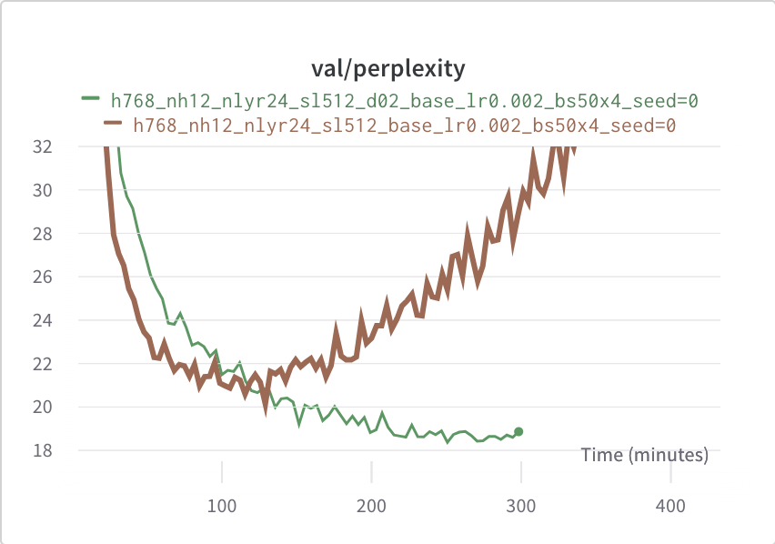

# LLM-baselines

A modular codebase to experiment with transformers, inspired from NanoGPT. 

## Quickstart 

Install dependencies: 

```
pip install -r requirements.txt
```

Run a simple training on the Wikitext dataset:

```
python ./src/main.py
```

If you don't have so much VRAM:

```
python ./src/main.py --n_layer 12 --sequence_length 256
```


## Less quick start

Here are the possible parameters you can use (copypasta from `main.py`):

```python
    # General training params
    parser.add_argument('--batch_size', default=50, type=int)
    parser.add_argument('--acc_steps', default=4, type=int)
    parser.add_argument('--seed', default=0, type=int)
    parser.add_argument('--device', default='cuda:0', type=str)
    parser.add_argument('--iterations', default=15000, type=int)
    parser.add_argument('--lr', default=2e-3, type=float)
    parser.add_argument('--warmup_percent', default=0.02, type=float)
    parser.add_argument('--weight_decay', default=1e-3, type=float)
    parser.add_argument('--beta1', default=0.9, type=float)
    parser.add_argument('--beta2', default=0.95, type=float)
    parser.add_argument('--scheduler', default='cos', choices=['linear', 'cos', 'none'])
    parser.add_argument('--opt', default='adamw', choices=['adamw', 'sgd'])
    parser.add_argument('--eval_freq', default=200, type=int) # in iterations
    parser.add_argument('--results_base_folder', default="./exps", type=str) 
    # Sparsity params (for sparse models)
    parser.add_argument('--lmbda', default=0.0001, type=float) # control the l1 penalty
    parser.add_argument('--n_alpha_mlp', default=256, type=int) # hidden size of the MLP predicting the alphas
    parser.add_argument('--alphas_from', default='q', choices=['q', 'x']) # whether to compute alphas from the queries or x
    parser.add_argument('--use_sigmoid', action='store_true') # if not set then use piecewise-linear approx
    # Dataset params
    parser.add_argument('--dataset', default='wikitext', choices=['wikitext', 'arxiv'])
    parser.add_argument('--vocab_size', default=50304, type=int)
    # Model params
    parser.add_argument('--model', default='base', choices=['base', 'sparse-heads-q', 'sparse-heads-qk', 'sparse-tokens-q', 'sparse-tokens-qk'])
    parser.add_argument('--use_pretrained', default="none", type=str) # 'none', 'gpt-2' or a path to the pretraind model
    parser.add_argument('--dropout', default=0.2, type=float)
    parser.add_argument('--n_head', default=12, type=int)
    parser.add_argument('--n_layer', default=24, type=int) # depths in att + ff blocks
    parser.add_argument('--n_embd', default=768, type=int) # embedding size / hidden size ... 
    parser.add_argument('--sequence_length', default=512, type=int)
    parser.add_argument('--dtype', default=torch.bfloat16, type=torch.dtype)
    parser.add_argument('--bias', default=False, type=bool)
    parser.add_argument('--no_compile', action='store_true') # if true then model is not compiled 
    # logging params (WandB)
    parser.add_argument('--wandb', action='store_true') # whether to use wandb or not
    parser.add_argument('--wandb_project', default="my-project", type=str)
    parser.add_argument('--wandb_run_prefix', default="none", type=str) # is added before the autogenerated experiment name
    parser.add_argument('--eval_seq_prefix', default="The history of Switzerland ", type=str) # prefix used to generate sequences
```

## Using WAndB

You need to give your wandb authorize key in order to send the data to your wandb account. If you start jobs on a server without access to prompt, then you can set the `WANDB_API_KEY` variable within your script:

```bash
# this is a script that could be executed on a server
pip install -r requirements.txt # install req.
export WANDB_API_KEY="put your authorize key here, to find it: https://wandb.ai/authorize"
python ./src/main.py --wandb --wandb_project "my awesome project" --n_layer 7 --model base --seed 123
```

## How to add your own transformer architecture? 

The structure of the project is the following: 

```sh
src/
    main.py         # pick the right data, model, and training function
    data/
        utils.py    # contains the get_dataset function
        wikitext.py # load/process wikitext
        arxiv.py    # load/process arxiv
    models/
        utils.py    # contains the get_model function
        base.py     # contains the standard transformer base architecture
    optim/
        utils.py    # contains eval and get_batch functions
        base.py     # training function for the base model
        sparse.py   # training funnction for the sparse model
```

Given the above structure, to add your own model, you can just fork the `./src/models/base.py` file, do your modifications, then if necessary change fork the `./src/optim/base.py` in case you need some custom training loop. To add a new dataset, create a new file in the `data` folder, check `wikitext.py` for the expected format. 


## Results on wikitext

Trying to get the best perplexity as fast as possible, I settled for using a model with the following parameters:
* n_embd: 768
* n_head: 12
* dropout: 0.2 (0.1 also works fine)
* n_layer: 24
* sequence_length: 512
* batch_size: 50
* acc_steps: 4
* iterations: 15000
* lr: 0.002
* warmup_percent: 0.02

The training reaches convergence after a bit more than 4 hours (on one V100), with a perplexity around 18.5, which I believe to be good for a non-pretrained model. The figure below shows the evolution of perplexity for two models with and without dropout, showing the importance of dropout. It should be possiblee to reach similar perplexity without dropout with a smaller batch size but this would probably extend the duration of the training. 



