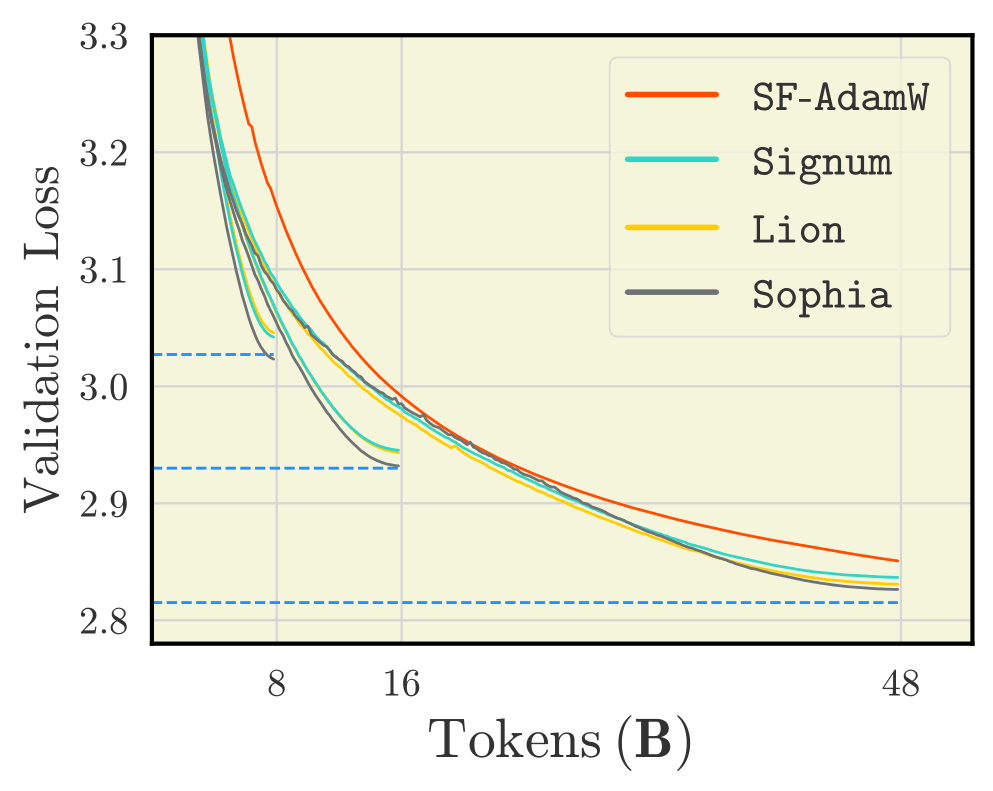
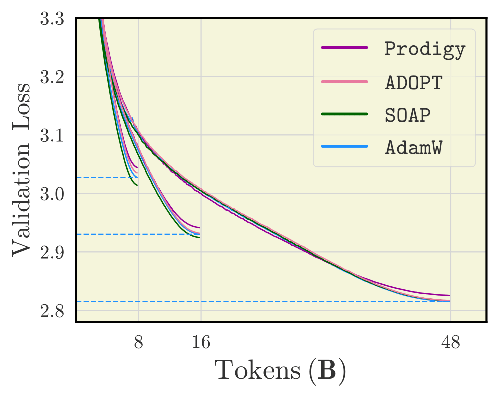
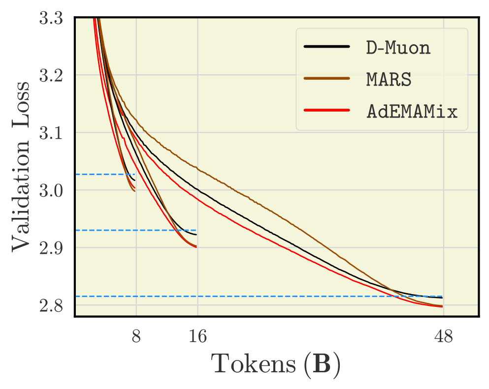
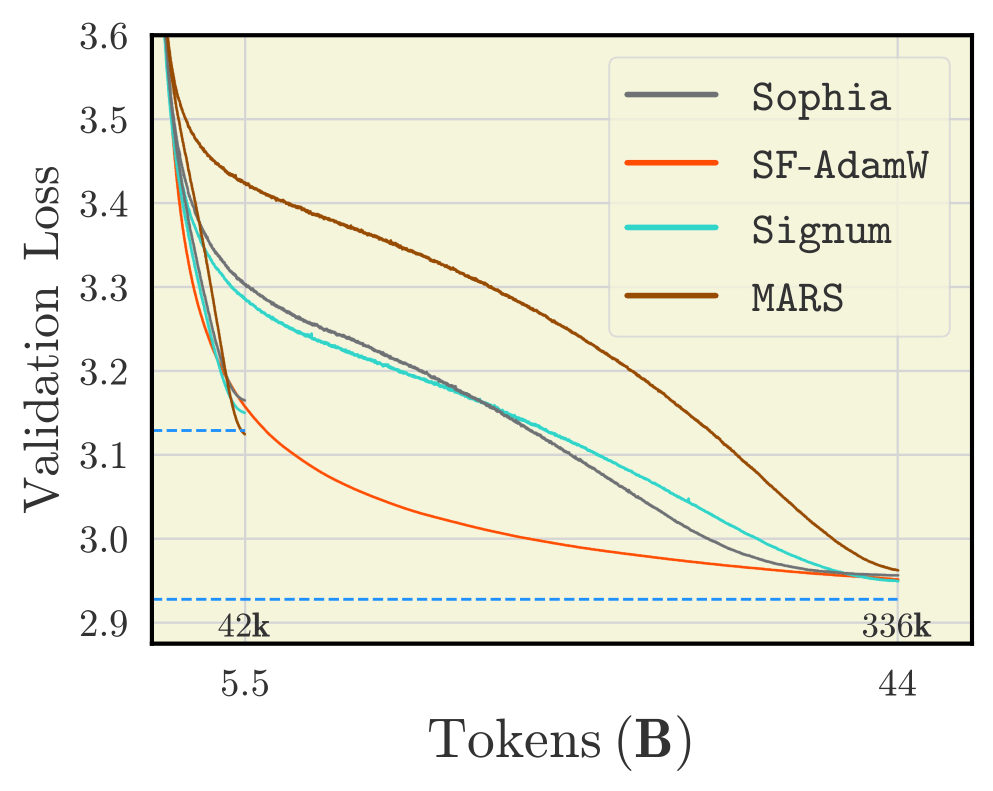
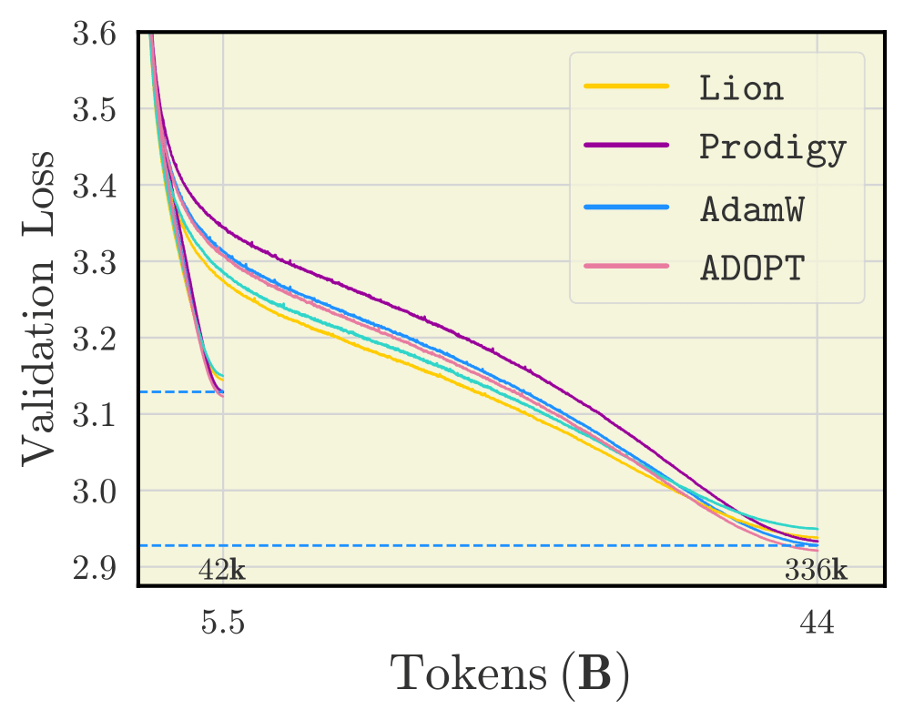
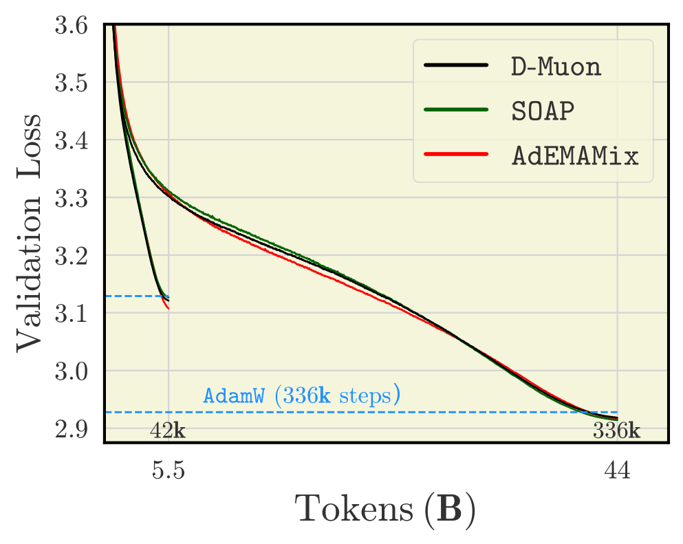

# Codebase: "Benchmarking Optimizers for Large Language Model Pretraining"

The code is largely based on our framework [llm-baselines](https://github.com/epfml/llm-baselines) to do research on training LLMs as an extension of [nanoGPT](https://github.com/karpathy/nanogpt).

This code comes jointly with reference:

> Andrei Semenov, Matteo Pagliardini, Martin Jaggi.

Date: September 2025

**Abstract:**
> The recent development of Large Language Models (LLMs) has been accompanied by an effervescence of novel ideas and methods to better optimize the loss of deep learning models. Claims from those methods are myriad: from faster convergence to removing reliance on certain hyperparameters. However, the diverse experimental protocols used to validate these claims make direct comparisons between methods challenging. This study presents a comprehensive evaluation of recent optimization techniques across standardized LLM pretraining scenarios, systematically varying model size, batch size, and training duration. Through careful tuning of each method, we provide guidance to practitioners on which optimizer is best suited for each scenario. For researchers, our work highlights promising directions for future optimization research. Finally, by releasing our code and making all experiments fully reproducible, we hope our efforts can help the development and rigorous benchmarking of future methods.

## Quickstart 

Create a conda environment and install dependencies:

```
conda create -n env python=3.10
conda activate env
pip install -r requirements.txt
```

Run a simple training on the SlimPajama 6B dataset:

```sh
python ./src/main.py --config_format base --model llama
```

The above command trains a 123.59M parameters model with the Llama-style architecture. To train the MoE model, use the ```---moe``` flag.

## Reproducibility

We [present]() scripts for reproducing our benchmarking results for 124M, 210M, 720M dense Llama-based models, and 520M MoEs.
Set the [wandb logging](README.md#using-wandb) and run those scripts to obtain the results as below.

<p align="center">
  
  
  
</p>
**Figure:** results for 720M Llama-style models trained with a batch size of 1M tokens.

<p align="center">
  
  
  
</p>
**Figure:** results for 520M MoE models trained with a batch size of 130k tokens.

## Less quick start

Here are the possible parameters you can use (copypasted from `config/base.py`):

```python
# General training params
parser.add_argument('--batch_size', default=32, type=int)
parser.add_argument('--acc_steps', default=4, type=int)
parser.add_argument('--seed', default=0, type=int) # random seed for the parameters
parser.add_argument('--data_seed', default=1337, type=int) # random seed defining the data ordering
parser.add_argument('--eval_interval', default=200, type=int)
parser.add_argument('--full_eval_at', nargs="+", type=int)
parser.add_argument('--eval_batches', default=64, type=int)
parser.add_argument('--device', default='cuda:0', type=str) # see below to run on multiple GPUs
parser.add_argument('--iterations', default=25000, type=int) # total number of training iterations
parser.add_argument('--warmup_steps', default=300, type=int)
parser.add_argument('--lr', default=1e-3, type=float)
parser.add_argument('--wsd_final_lr_scale', default=0.0, type=float) # wsd scheduler
parser.add_argument('--wsd_fract_decay', default=0.1, type=float) # wsd scheduler 
parser.add_argument('--decay_type', default='linear', choices=['linear', 'cosine', 'exp', 'miror_cosine', 'square', 'sqrt'])
parser.add_argument('--weight_decay', default=0.1, type=float) # I recommend you keep this value, else instabilities might arise
parser.add_argument('--beta1', default=0.9, type=float) # adam parameter
parser.add_argument('--beta2', default=0.95, type=float) # adam parameter
parser.add_argument('--scheduler', default='cos', choices=['linear', 'cos', 'wsd', 'cos_inf', 'none'])
parser.add_argument('--final_div_factor', default=1, type=float) # cosine and linear schedulers
parser.add_argument('--cos_inf_steps', default=0, type=int) # cos_inf scheduler
parser.add_argument('--opt', default='adamw', choices=['adamw', 'sgd', 'muon', 'soap', 'ademamix', 'lion', 'sf-adamw', 'sf-sgd', 'signsgd', 'signum', 'prodigy', 'sophiag', 'adopt', 'mars', 'adafactor', 'lamb', 'd-muon'])
parser.add_argument('--eval_freq', default=200, type=int) # in iterations
parser.add_argument('--results_base_folder', default="./exps", type=str) # where the checkpoints will be saved
parser.add_argument('--grad_clip', default=0.0, type=float) # default value is 1.0 in nanoGPT
parser.add_argument('--momentum', default=0.9, type=float)
parser.add_argument('--shampoo_beta', default=-1.0, type=float)
parser.add_argument('--precondition_frequency', default=10, type=int) #for SOAP and Sophia
parser.add_argument('--max_precond_dim', default=10000, type=int)
parser.add_argument('--merge_dims', default=False, type=bool) # merge dimensions till the product of the dimensions is less than or equal to max_precond_dim
parser.add_argument('--precondition_1d', default=False, type=bool)
parser.add_argument('--normalize_grads', default=False, type=bool)
parser.add_argument('--soap_data_format', default='channels_first', type=str)
parser.add_argument('--correct_bias', default=True, type=bool)
parser.add_argument('--nesterov', default=False, type=bool) # whether to use Nesterov-style momentum 
parser.add_argument('--muon_ns_steps', default=5, type=int) # the number of steps to use in the newton schulz, if it is iterative
parser.add_argument('--muon_lr_factor', default=0.02, type=float) # a factor by which to reduce the lr for muon
parser.add_argmunet('--adema_beta3', default=0.9, type=float) # beta3 in AdEMAMix
parser.add_argument('--adema_alpha', default=2.0, type=float) # alpha in AdEMAMix
parser.add_argument('--adema_beta3_warmup', default=None, type=int) # AdEMAMix hyperparameter
parser.add_argument('--adema_alpha_warmup', default=None, type=int) # AdEMAMix hyperparameter
parser.add_argument('--schedulefree_r', defalut=0.0, type=float) # schedulefree hyperparameter
parser.add_argument('--weight_lr_power', default=2.0, type=float) # schedulefree hyperparameter
parser.add_argument('--log_interval', default=50, type=int)
parser.add_argument('--dampening', default=0.0, type=float)
parser.add_argument('--prodigy_beta3', default=None, type=float) # coefficients for computing the Prodidy stepsize using running averages
parser.add_argument('--prodigy_decouple', default=True, type=bool) # Use AdamW style decoupled weight decay
parser.add_argument('--prodigy_use_bias_correction', default=False, type=bool)
parser.add_argument('--prodigy_safeguard_warmup', default=False, type=bool) # Remove lr from the denominator of D estimate to avoid issues during warm-up stage. Off by default.
parser.add_argument('--prodigy_fsdp_in_use', default=False, type=bool)
parser.add_argument('--sophia_rho', default=0.04, type=float)
parser.add_argument('--clipping_type', default='no', choices=['no', 'local', 'elementwise']) # for methods with clipping
parser.add_argument('--clipping_eta', default=1.0, type=float)
parser.add_argument('--mars_type', default='mars-adamw', choices=['mars-adamw', 'mars-lion', 'mars-shampoo'],)
parser.add_argument('--mars_vr_gamma', default=0.025, type=float)
parser.add_argument('--mars_is_approx', default=True, type=float)
parser.add_argument('--mars_lr', default=3e-3, type=float)
parser.add_argument('--mars_beta1', default=0.95, type=float)
parser.add_argument('--mars_beta2', default=0.99, type=float)
parser.add_argument('--adafactor_decay_rate', default=-0.8, type=float)
parser.add_argument('--lamb_use_bias_correction', default=False, type=bool)
parser.add_argument('--adopt_decouple', default=True, type=bool)
parser.add_argument('--adopt_eps', default=1e-6, type=float)
# Dataset params
parser.add_argument('--dataset', default='slimpajama', choices=['slimpajama', 'wikitext', 'shakespeare-char', 'arxiv', 'arxiv2000', 'arxiv+wiki', 'openwebtext2', 'redpajama', 'redpajamav2', 'slimpajama_chunk1', 'fineweb', 'finewebedu', 'c4'])
parser.add_argument('--tokenizer', default='gpt2', type=str, choices=['gpt2', 'mistral'])
parser.add_argument('--vocab_size', default=50304, type=int)
parser.add_argument('--data_in_ram', action='store_true') # force the data to RAM, you most likely do not need this  
# Model params
parser.add_argument('--model', default='base', choices=['base', 'llama', 'test'])
parser.add_argument('--parallel_block', action='store_true')
parser.add_argument('--use_pretrained', default='none', type=str) # 'none', 'gpt2' or a path to the pretraind model
parser.add_argument('--from_dense', action='store_true')
parser.add_argument('--init_std', default=0.02, type=float)
parser.add_argument('--dropout', default=0.0, type=float) # keep to 0 unless in low data regime (e.g. wikitext)
parser.add_argument('--n_head', default=12, type=int)
parser.add_argument('--n_layer', default=12, type=int) # depth in (att + ff) blocks
parser.add_argument('--n_embd', default=768, type=int) # hidden size ... 
parser.add_argument('--sequence_length', default=512, type=int)
parser.add_argument('--dtype', default='bfloat16', type=str, choices=['float32', 'float16', 'bfloat16'],)
parser.add_argument('--bias', default=False, type=bool)
parser.add_argument('--compile', action='store_true') # if true then model is compiled 
parser.add_argument('--rmsnorm_eps', default=1e-5, type=float) # used by the llama model
parser.add_argument('--multiple_of', default=256, type=int) # used by the llama model make SwiGLU hidden layer size multiple of large power of 2
parser.add_argument('--moe', action='store_true')
parser.add_argument('--moe_routing', default='standard_gating', type=str, choices=['standard_gating', 'expert_choice'],)
parser.add_argument('--moe_num_experts', default=8, type=int)
parser.add_argument('--capacity_factor', default=2.0, type=float) # only used for expert choice routing
parser.add_argument('--moe_num_shared_experts', default=0, type=int) # deepseek routing, experts that are always active
parser.add_argument('--moe_router_loss', default='load_balancing_z_loss', type=str, choices=['entropy', 'load_balancing_only', 'load_balancing_z_loss'],)
parser.add_argument('--moe_num_experts_per_tok', default=2, type=int)
parser.add_argument('--moe_entropy_loss_factor', default=0.01, type=float)
parser.add_argument('--moe_aux_loss_factor', default=0.1, type=float)
parser.add_argument('--moe_z_loss_factor', default=0.01, type=float)
parser.add_argument('--moe_softmax_order', type=str, default='topk_softmax', choices=['softmax_topk', 'topk_softmax'],)
parser.add_argument('--plot_router_logits', action='store_true')
# Checkpointing
parser.add_argument('--results_base_folder', default='./exps', type=str)
parser.add_argument('--permanent_ckpt_interval', default=0, type=int)
parser.add_argument('--latest_ckpt_interval', default=0, type=int)
parser.add_argument('--resume_from', default=None, type=str)
parser.add_argument('--resume_from_swa', default=None, type=str)
parser.add_argument('--auto_resume', default=True)
# logging params (WandB)
parser.add_argument('--wandb', action='store_true') # whether to use wandb or not
parser.add_argument('--wandb_project', default='my-project', type=str)
parser.add_argument('--wandb_entity', default=None, type=none_or_str) # for the team projects
parser.add_argument('--wandb_run_prefix', default='none', type=str) # is added before the autogenerated experiment name
parser.add_argument('--eval_seq_prefix', default="Once upon a time", type=str) # prefix used to generate sequences
parser.add_argument('--log_dynamics', action='store_true')
parser.add_argument('--dynamics_logger_cfg', default='./src/logger/rotational_logger.yaml', type=str)
parser.add_argument('--log_parameter_norms', action='store_true') # logs the L2 norm of the parameters
parser.add_argument('--norm_order', default=2) # order of the model norm to log
# Distributed args
parser.add_argument('--distributed_backend', default=None, type=str, required=False,
                    choices=distributed.registered_backends())  # distributed backend type (e.g. nccl)
```

## Using WandB

You need to give your wandb authorize key in order to send the data to your wandb account. If you start jobs on a server without access to prompt, then you can set the `WANDB_API_KEY` variable within your script:

```bash
# this is a script that could be executed on a server
pip install -r requirements.txt # install req.
export WANDB_API_KEY="put your authorize key here, to find it: https://wandb.ai/authorize"
python ./src/main.py --config_format base --wandb --wandb_project "my awesome project" --n_layer 7 --model llama --seed 123
```

## How to add your own transformer architecture? 

The structure of the project is the following: 

```sh
src/
    main.py         # pick the right data, model, and training function
    config/
        __init__.py # contains CONFIG_FORMAT_TO_MODULE_MAP mapping the name given to the --config_format flag with a python conf file
        base.py     # config for the base model
    data/
        utils.py    # contains the get_dataset function
        wikitext.py # load/process wikitext
        arxiv.py    # load/process arxiv
        shakespeare.py # load/process the Shakespeare dataset
        slimpajama.py
        ...
    models/
        utils.py    # contains the get_model function
        base.py     # contains the standard transformer base architecture
        llama.py    # llama architecture
    optim/
        utils.py    # contains eval and get_batch functions
        base.py     # training function for the base and llama models
        ...
    distributed/
        # code to enable simple distributed training
```

Given the above structure, to add your own model, you can just fork the `./src/models/base.py` file, do your modifications, then if necessary fork the `./src/optim/base.py` in case you need some custom training loop or evaluation. You also need to fork the `./src/config/base.py` file to add your own parameters, which imply adding your new config to the mapping `CONFIG_FORMAT_TO_MODULE_MAP` in `./src/config/__init__.py`. To add a new dataset, create a new file in the `data` folder, check `wikitext.py` for the expected format. 

**Note:** we use [black](https://black.readthedocs.io/en/stable/the_black_code_style/current_style.html) and [isort](https://pycqa.github.io/isort/) for all pull requests. Before committing your code, simply run ```black . && isort .``` and you will be fine.

## Multi-GPU training

Given a multi-GPU machine with e.g. 4 GPUs, one can distribute the training using data-parallelism:

```sh
torchrun --nproc_per_node=4 ./src/main.py --config_format base --distributed_backend nccl --dataset slimpajama --model base
```

When using multiple GPUs, the data will be distributed among the GPUs by dividing the number of accumulation steps by the number of nodes. For instance if we train with a batch size of 32 and 4 accumulation steps, then each GPU will process batches of 32 elements and do 1 accumulation steps. For this reason we require `acc_steps` to be a multiple of the number of GPUs. 

## Experimenting locally on your device with CPU
If do not have access to a GPU or just want to try the code locally on your device, you can try the Shakespeare dataset with character-level tokens:

```sh
python ./src/main.py --n_layer=2 --n_head=4 --n_embd=128 --sequence_length=256 --dataset=shakespeare-char --device=cpu --vocab_size=96
```

**We believe the details provided are clear enough to reproduce the main findings of our paper.**